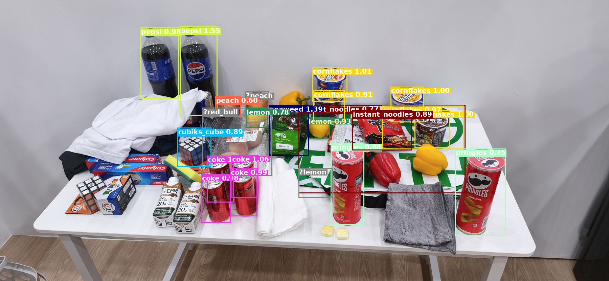

# detecty — RoboCup@Home 객체용 YOLO 라벨 자동 생성

> 🇰🇷 한국어 문서가 먼저 나오고, 아래에 영어 원문(English)이 이어집니다.

RoboCup@Home 2026 (인천) 객체에 대한 YOLO **검출(detection)** 데이터셋을 수작업
주석 없이 부트스트랩합니다. 권장 파이프라인은 **위치 추정(localization)과
분류(classification)를 분리**합니다:

1. **위치 추정** — Grounding DINO가 객체 박스를 찾습니다 (클래스 비의존적).
2. **분류** — 각 크롭을 **앙상블**로 라벨링합니다: DINOv3-L 최근접 프로토타입
   + 마스크된 HSV 색상 + OCR 브랜드 텍스트를 융합하며, 불확실한 크롭은
   추측 대신 `review/` 로 보냅니다.

이는 순수 텍스트(Grounding DINO)와 YOLOE few-shot이 모두 틀리는 브랜드/색상
**쌍둥이(twins)** (`coke` vs `red_bull`, `pepsi` vs `soju`, `plate` vs `bowl`,
빨강 vs 노랑 파프리카)를 안정적으로 구분하는 유일한 방법입니다.

## 데모

밀집된 더미(`media/ultimate_test.jpg`)에 `SamYolo().detect()` 를 실행:



```python
from detecty import SamYolo
with SamYolo(device="cpu") as det:          # setup() / shutdown() 자동 처리
    result = det.detect("media/ultimate_test.jpg")
# result["detections"] = [{class, class_id, score, margin, candidates,
#                          bbox, bbox_norm, review, source}, ...]
```

**무엇을 보여주는가.** 앙상블은 쌍둥이를 정확히 맞춥니다 — 펩시 병 2개를 모두
`pepsi`(코크 아님), 빨간 캔을 모두 `coke`(레드불 아님), `pringles` ×2,
`cornflakes` ×5, `instant_noodles` ×2, `seaweed`, `rubiks_cube` — 그리고 정말
애매한 과일은 review(회색 `?` 박스)로 보냅니다. 동시에 **위치 추정 재현율(recall)
한계**도 솔직하게 드러납니다: 심한 혼잡 속에서 generic Grounding DINO 패스가 일부
객체(콜게이트 박스, 우유갑, 셔츠/수건, 파프리카, 스펀지)를 아예 놓쳐 박스가
생기지 않습니다. 분류는 강력하며, 밀집 더미에서는 **위치 추정**이 개선 대상입니다
(더 촘촘한 프롬프트 / 더 강한 로컬라이저 / 타일링). 점수는 융합 매칭 점수(DINOv3
코사인 + 색상 + OCR 보너스)이며 확률이 아니므로 1.0을 넘을 수 있습니다.

> **하드웨어:** 대상 GPU는 **1 GB VRAM** — 이 모델들에는 너무 작아 **모든 것이
> 기본적으로 CPU에서 실행**됩니다. 데이터셋이 작아 CPU로 충분합니다 (Grounding
> DINO는 느린 편, DINOv3-L 임베딩은 크롭당 몇 초). Grounding DINO 축소는
> *양자화* 절을 참고하세요.

## 클래스 = 공식 정답(ground truth)

RoboCup@Home 2026 (인천)의 30개 Known Objects이며, 이름과 카테고리는
[RoboCupAtHome/Incheon2026](https://github.com/RoboCupAtHome/Incheon2026/tree/main/objects)
에서 가져왔습니다. 공식 참조 사진은 `objects_gt/` 에 미러링되어 있습니다. 분류
체계는 `src/detecty/data/config.yaml` 에서 편집하세요.

## 설치

```bash
# 1) 플랫폼에 맞는 PyTorch (CPU 빌드 예시; 1 GB GPU는 모델을 올릴 수 없음):
pip install torch torchvision --index-url https://download.pytorch.org/whl/cpu

# 2) 패키지 + 추가 의존성
pip install -e .            # 코어: Grounding DINO + DINOv3 앙상블
pip install -e ".[ocr]"     # + EasyOCR 브랜드 매칭 (권장)
pip install -e ".[train]"   # + Ultralytics/scipy/pandas (YOLO 학습)
pip install -e ".[vlm]"     # + 선택적 VLM 컨설트용 openai 클라이언트
pip install -e ".[all]"     # 전체
```

콘솔 명령 (pip로 모두 설치됨):
`detecty-extract-frames`, `detecty-localize`, `detecty-build-prototypes`,
`detecty-label`, `detecty-visualize`, `detecty-split`, `detecty-train`,
`detecty-label-yoloe`.

## 엔드투엔드(전체 흐름)

```bash
# 0. (선택) 영상에서 프레임 샘플링 -> frames/
detecty-extract-frames --videos-dir object --out frames --every 1.0

# 1. 위치 추정 (클래스 비의존 박스; generic 모드 = 이미지당 빠른 GD 1패스)
detecty-localize --images-dir object --out dataset/raw_gd --mode generic

# 2. 객체별 in-domain 크롭 몇 장을 prototypes/<class>/*.jpg 에 수집
#    (많을수록 좋음, 특히 브랜드/색상 쌍둥이), 그 후 뱅크 빌드:
detecty-build-prototypes

# 3. 앙상블로 각 박스 분류; 불확실한 크롭 -> dataset/raw/review/
detecty-label --boxes-from dataset/raw_gd --out dataset/raw --multiview

# 4. QA + review 큐 정리
detecty-visualize --raw dataset/raw --out qa_embed

# 5. 장면 그룹 기반 train/val 분할 (+ dataset.yaml; 버스트/영상 누수 없음)
detecty-split --raw dataset/raw --out dataset --val 0.2

# 6. 실제 GPU/클러스터에서 학습 (1 GB 로컬 GPU로는 학습 불가)
detecty-train --data dataset/dataset.yaml --model yolo11s.pt --epochs 100
```

앙상블 정확도는 **프로토타입 뱅크**에 좌우됩니다: `prototypes/` 에 in-domain
크롭이 있는 클래스는 안정적이고, 카탈로그 전용 클래스는 `review/` 로 더 자주
갑니다 — 크롭 몇 장 추가로 해결됩니다. 또한 로컬라이저의 박스 오류를 그대로
물려받으므로(테이블 다리에 잘못 잡힌 박스도 크롭이 됨) `config.yaml` 의 GD
임계값/면적 필터를 적절히 유지하세요.

## 선택적 VLM 컨설트 (기본 꺼짐)

`detecty-label --vlm` 은 가장 어려운 크롭(마진이 review 임계값의 절반 미만)에서만
**vLLM** 으로 서빙되는 **Gemma-3n-E4B** 모델에 질의합니다. 자문용이며, 후보
라벨로만 제한되고, **요청하지 않으면 꺼져 있습니다**. 설정:

```bash
export DETECTY_VLM_URL=http://localhost:8000/v1
export DETECTY_VLM_MODEL=google/gemma-3n-e4b-it
vllm serve google/gemma-3n-e4b-it --max-model-len 4096    # 성능 있는 호스트에서
```

드물게 사용하고 그 호출을 검증하세요 — `src/detecty/vlm_consult.py` 참고.

## 양자화 (Grounding DINO 축소)

`detecty-localize --quantize` 는 Grounding DINO에 동적 INT8(`quantize_dynamic`,
CPU 전용)을 적용합니다. 본 데이터셋(어려운 장면 3개, generic 모드) 측정값:

| | fp32 | INT8 |
|---|---|---|
| 체크포인트 크기 | 689.6 MB | **254.3 MB** (2.7× 작음) |
| 매칭 박스 평균 IoU | — | **0.903** (위치 거의 동일) |
| 평균 \|Δ점수\| | — | 0.042 |
| thr 0.25에서 유지된 박스 | 34 | 26 (매칭 25, 누락 9, 신규 1) |

유지된 박스는 거의 변하지 않지만(IoU ≈ 0.90), INT8은 고정 임계값에서 한계 박스의
약 25%를 놓칩니다 — 그래서 `--quantize` 는 `--quant-thr-comp`(기본 0.05)만큼
임계값을 자동으로 낮춰 재현율을 회복하고, 앙상블이 다시 분류하며 NMS로 여분을
거릅니다. 참고: PyTorch 동적 INT8은 **CPU 전용**(CUDA 커널 없음)이라 용량/적재
이점이지 1 GB GPU로 가는 경로는 아닙니다 — GPU라면 fp16(~345 MB)이 필요하지만
1280px에서는 여전히 안 맞을 가능성이 큽니다.

## 방법 비교 & 측정

| 방법 | 브랜드/색상 쌍둥이 | 비고 |
|---|---|---|
| Grounding DINO 텍스트 (`detecty-localize --mode classes`) | ✗ 브랜드를 못 읽음 | 로컬라이저로도 사용 |
| YOLOE-26x few-shot (`detecty-label-yoloe`) | ✗ 교차 이미지에서 불안정 | 실험적 |
| **앙상블 (`detecty-label`)** | **✓ coke/red_bull, pepsi, plate/bowl** | **권장** |

어려운 장면에서 검증됨: 앙상블은 한 장면의 빨간 캔을 `coke` 로, 다른 장면의
레드불을 `red_bull` 로 정확히 라벨링하고(다른 방법들이 틀리는 바로 그 쌍둥이),
Grounding DINO의 환각은 `review/` 로 보냅니다.

## 프로젝트 구조

```
src/detecty/            # 패키지 (pip 설치 가능)
  data/                 # config.yaml, ensemble.yaml, visual_prompts.yaml, train.slurm
  localize_gd.py build_prototypes.py autolabel_embed.py ...
objects_gt/             # 객체별 공식 Incheon2026 참조 사진
prototypes/<class>/*.jpg# 직접 수집한 in-domain 크롭 (few-shot 뱅크)
object/                 # 원본 촬영 데이터 (배포 안 함; .gitignore 참고)
```

---

# detecty — automatic YOLO labels for RoboCup@Home objects

> 🇬🇧 English version (한국어 문서는 위쪽에 있습니다).

Bootstrap a YOLO **detection** dataset for the RoboCup@Home 2026 (Incheon)
objects without hand-annotating from scratch. The recommended pipeline
**decouples localization from classification**:

1. **Localize** — Grounding DINO finds object boxes (class-agnostic).
2. **Classify** — each crop is labeled by an **ensemble**: DINOv3-L
   nearest-prototype + masked HSV colour + OCR brand text, fused, with
   uncertain crops routed to `review/` instead of being guessed.

This is the only method here that reliably resolves the brand/colour **twins**
(`coke` vs `red_bull`, `pepsi` vs `soju`, `plate` vs `bowl`, red vs yellow
bell pepper) that pure text (Grounding DINO) and YOLOE few-shot both get wrong.

## Demo

`SamYolo().detect()` on a dense pile (`media/ultimate_test.jpg`):


```python
from detecty import SamYolo
with SamYolo(device="cpu") as det:          # setup() / shutdown() handled
    result = det.detect("media/ultimate_test.jpg")
# result["detections"] = [{class, class_id, score, margin, candidates,
#                          bbox, bbox_norm, review, source}, ...]
```

**What it shows.** The ensemble nails the twins — both Pepsi bottles as `pepsi`
(not coke), all the red cans as `coke` (not red_bull), `pringles` ×2,
`cornflakes` ×5, `instant_noodles` ×2, `seaweed`, `rubiks_cube` — and routes the
genuinely ambiguous fruit to review (grey `?` boxes). It also honestly shows the
**localizer recall gap**: in heavy clutter the generic Grounding DINO pass misses
some objects entirely (Colgate boxes, milk cartons, shirts/towels, bell peppers,
sponge), so they get no box. Classification is strong; dense-pile **localization**
is the thing to improve (denser prompts / a stronger localizer / tiling).
Scores are fused match scores (DINOv3 cosine + colour + OCR bonus), not
probabilities, so they can exceed 1.0.

> **Hardware:** target GPU has **1 GB VRAM** — too small for these models, so
> **everything defaults to CPU**. The dataset is small enough that CPU is fine
> (Grounding DINO ~slow; DINOv3-L embedding a few seconds/crop). See
> *Quantization* for shrinking Grounding DINO.

## Classes = official ground truth

The 30 Known Objects of RoboCup@Home 2026 (Incheon), names + categories from
[RoboCupAtHome/Incheon2026](https://github.com/RoboCupAtHome/Incheon2026/tree/main/objects).
Official reference photos are mirrored in `objects_gt/`. Edit the taxonomy in
`src/detecty/data/config.yaml`.

## Install

```bash
# 1) PyTorch for your platform (CPU build shown; 1 GB GPU can't fit the models):
pip install torch torchvision --index-url https://download.pytorch.org/whl/cpu

# 2) the package + extras
pip install -e .            # core: Grounding DINO + DINOv3 ensemble
pip install -e ".[ocr]"     # + EasyOCR brand matching   (recommended)
pip install -e ".[train]"   # + Ultralytics/scipy/pandas (YOLO training)
pip install -e ".[vlm]"     # + openai client for the optional VLM consult
pip install -e ".[all]"     # everything
```

Console commands (all installed by pip):
`detecty-extract-frames`, `detecty-localize`, `detecty-build-prototypes`,
`detecty-label`, `detecty-visualize`, `detecty-split`, `detecty-train`,
`detecty-label-yoloe`.

## End-to-end

```bash
# 0. (optional) sample frames from videos -> frames/
detecty-extract-frames --videos-dir object --out frames --every 1.0

# 1. LOCALIZE (class-agnostic boxes; generic mode = one fast GD pass/image)
detecty-localize --images-dir object --out dataset/raw_gd --mode generic

# 2. COLLECT a few in-domain crops per object into prototypes/<class>/*.jpg
#    (more = better, especially the brand/colour twins), then build the bank:
detecty-build-prototypes

# 3. CLASSIFY each box with the ensemble; uncertain crops -> dataset/raw/review/
detecty-label --boxes-from dataset/raw_gd --out dataset/raw --multiview

# 4. QA + clear the review queue
detecty-visualize --raw dataset/raw --out qa_embed

# 5. scene-grouped train/val split (+ dataset.yaml; no burst/video leakage)
detecty-split --raw dataset/raw --out dataset --val 0.2

# 6. train on a real GPU / cluster (1 GB local GPU can't train)
detecty-train --data dataset/dataset.yaml --model yolo11s.pt --epochs 100
```

The ensemble's accuracy tracks the **prototype bank**: classes with in-domain
crops in `prototypes/` are reliable; catalog-only classes land in `review/`
more often — add a couple crops to fix them. It also inherits localizer box
errors (a bad box on a table-leg still yields a crop), so keep the GD
thresholds/area filter sane in `config.yaml`.

## Optional VLM consult (off by default)

`detecty-label --vlm` consults a **Gemma-3n-E4B** model served by **vLLM** on the
very hardest crops only (margin below half the review threshold). It is advisory,
constrained to the candidate labels, and **off unless requested**. Configure:

```bash
export DETECTY_VLM_URL=http://localhost:8000/v1
export DETECTY_VLM_MODEL=google/gemma-3n-e4b-it
vllm serve google/gemma-3n-e4b-it --max-model-len 4096    # on a capable host
```

Use sparingly and verify its calls — see `src/detecty/vlm_consult.py`.

## Quantization (shrink Grounding DINO)

`detecty-localize --quantize` applies dynamic INT8 (`quantize_dynamic`, CPU-only)
to Grounding DINO. Measured on this dataset (3 hard scenes, generic mode):

| | fp32 | INT8 |
|---|---|---|
| checkpoint size | 689.6 MB | **254.3 MB** (2.7× smaller) |
| matched-box mean IoU | — | **0.903** (localization ~unchanged) |
| mean \|Δscore\| | — | 0.042 |
| boxes kept @ thr 0.25 | 34 | 26 (25 matched, 9 missed, 1 new) |

Retained boxes barely move (IoU ≈ 0.90), but INT8 drops ~25% of marginal boxes at
a fixed threshold — so `--quantize` auto-lowers the thresholds by
`--quant-thr-comp` (default 0.05) to recover recall; the ensemble then re-classifies
and NMS-filters any extras. Note: PyTorch dynamic INT8 is **CPU-only** (no CUDA
kernels), so this is a footprint/loading win, not a route onto the 1 GB GPU — for
GPU you'd need fp16 (~345 MB), which still likely won't fit at 1280 px.

## Methods & measurements

| method | brand/colour twins | notes |
|---|---|---|
| Grounding DINO text (`detecty-localize --mode classes`) | ✗ can't read brands | also the localizer |
| YOLOE-26x few-shot (`detecty-label-yoloe`) | ✗ unreliable cross-image | experimental |
| **Ensemble (`detecty-label`)** | **✓ coke/red_bull, pepsi, plate/bowl** | **recommended** |

Validated on the hard scenes: the ensemble correctly labels the red can as
`coke` in one scene and the Red Bull as `red_bull` in another (the exact twin
that breaks the other methods), and sends Grounding DINO's hallucinations to
`review/`.

## Project layout

```
src/detecty/            # the package (pip-installable)
  data/                 # config.yaml, ensemble.yaml, visual_prompts.yaml, train.slurm
  localize_gd.py build_prototypes.py autolabel_embed.py ...
objects_gt/             # official Incheon2026 reference photo per object
prototypes/<class>/*.jpg# your collected in-domain crops (few-shot bank)
object/                 # your raw capture data (not shipped; see .gitignore)
```

🛠️ Built with ❤️ by **Your Mom**
